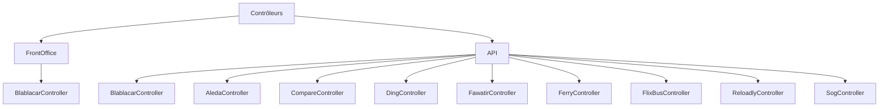
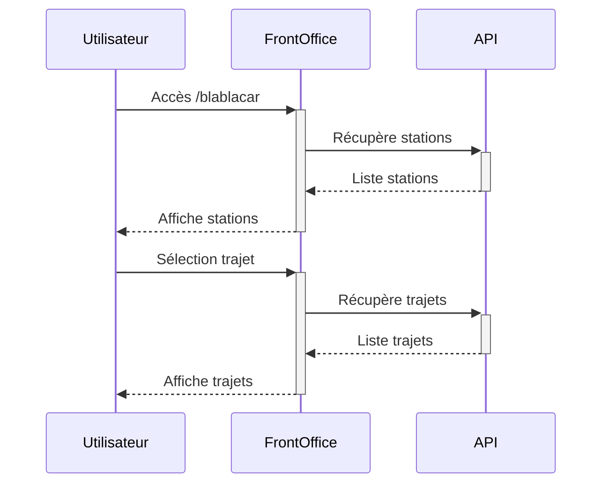
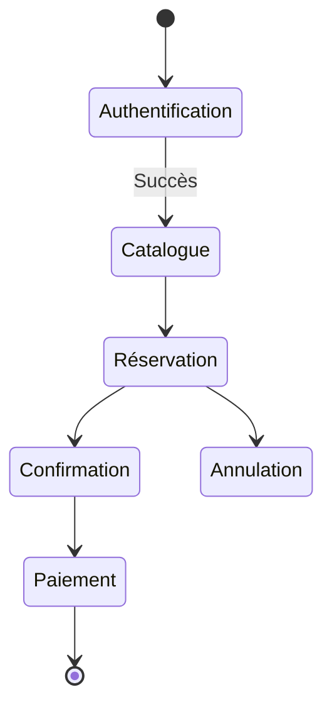
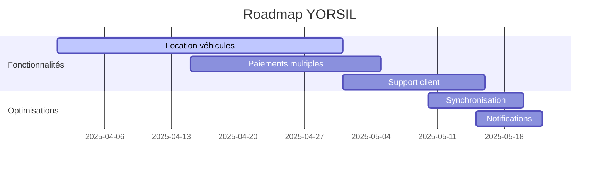

# Analyse et Cartographie des Contrôleurs Symfony

## 1. Structure Globale

## 2. Liste Complète des APIs
| Nom Contrôleur | Description | État | Dernière Activité |
|----------------|-------------|------|-------------------|
| BlablacarController | Gestion covoiturage | ✅ Actif | 2025-03-28 |
| AledaController | Gestion produits/ventes | ✅ Actif | 2025-03-29 |
| CompareController | Service de comparaisons | 🟡 Limité | 2025-02-15 |
| DingController | Intégration Ding | ❌ Inactif | 2024-11-30 |
| FawatirController | Service Fawatir | 🟡 Limité | 2025-01-10 |
| FerryController | Gestion traversées maritimes | ✅ Actif | 2025-03-27 |
| FlixBusController | Intégration FlixBus | ✅ Actif | 2025-03-29 |
| ReloadlyController | Service Reloadly | ❌ Inactif | 2024-09-01 |
| SogController | Service SOG | 🟡 Limité | 2025-03-10 |

## 2. Contrôleur FrontOffice/BlablacarController

### Routes Principales
| Route | Méthode | Description |
|-------|---------|-------------|
| `/blablacar` | GET | Page d'accueil Blablacar |
| `/trajets-disponibles` | GET/POST | Liste des trajets disponibles |
| `/trajet-selectionner` | GET/POST | Sélection d'un trajet |
| `/mode-paiement` | GET/POST | Page de paiement |

### Workflow

## 3. Contrôleur API/BlablacarController

### Services
- `ServiceBlablacar` : Gère l'intégration avec l'API Blablacar
- `EntityManager` : Gestion des entités Doctrine
- `Session` : Stockage des données temporaires

## 4. Contrôleur API/AledaController

### Routes Principales
| Route | Méthode | Description |
|-------|---------|-------------|
| `/solde-aleda` | GET | Récupère le solde agent |
| `/liste-catalogue-produit` | GET | Liste le catalogue produits |
| `/ajout-vente` | POST | Ajoute une vente |
| `/ajout-vente-pdf` | POST | Ajoute une vente avec PDF |
| `/reservation-vente` | POST | Réserve une vente |
| `/confirmation-vente` | POST | Confirme une vente |
| `/annulation-vente` | POST | Annule une vente |

### Workflow Ventes

## 5. Analyse Comparative

| Aspect | Blablacar | Aleda |
|--------|-----------|-------|
| Authentification | Token OAuth | X-Auth custom |
| Gestion State | Sessions | Sessions |
| Retours API | JSON | JSON |
| Sécurité | ROLE_BOUT | ROLE_USER |

## 6. Analyse vs Cahier des Charges

### Services Disponibles

1. **Télécommunications** :
   - Recharge mobile (ReloadlyController)
   - Transfert de crédit (ReloadlyController)

2. **Transport** :
   - Covoiturage (BlablacarController)
   - Bus (FlixBusController) 
   - Ferry (FerryController)

3. **Paiements** :
   - Transactions en ligne (AledaController)
   - Cartes cadeaux (AledaController)

4. **API Partenaires** :
   - Authentification OAuth 2.0
   - Intégration Western Union
   - Intégration Moneygram

### Services Manquants

1. **Location** :
   - Yorsilloc (véhicules)

2. **Marketplace** :
   - Produits divers
   - Services tiers

3. **Support Client** :
   - Chat intégré
   - FAQ dynamique
   - Ticket système

4. **Paiements** :
   - PayPal
   - Apple Pay  
   - Google Pay

5. **Synchronisation** :
   - Temps réel web/mobile
   - Notifications push

### Recommandations Prioritaires

1. **Développement** :
   - Implémenter YorsillocController pour la location
   - Ajouter PaymentController pour méthodes de paiement manquantes
   - Créer SupportController pour le chat client

2. **Optimisation** :
   - Unifier l'authentification (OAuth 2.0 partout)
   - Implémenter la synchronisation temps réel
   - Ajouter les notifications push

3. **Sécurité** :
   - Audit des flux de paiement
   - Chiffrement des données sensibles
   - Validation renforcée des inputs

4. **Roadmap** :

