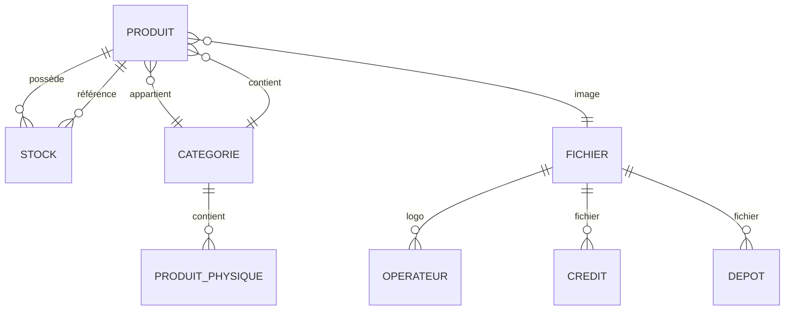

# Cartographie des Entités et Relations

## Diagramme des relations

## Détails des relations

- **Produit**
  - appartient à une **Catégorie**
  - est lié à un **Fichier** (image ou document)
  - possède plusieurs **Stocks**

- **Categorie**
  - contient plusieurs **Produits**
  - contient aussi des **ProduitPhysique**

- **Fichier**
  - utilisé par plusieurs entités : `Operateur`, `Credit`, `Depot`
  - mais la relation avec `Produit` est **unidirectionnelle** (non reflétée dans `Fichier`)

- **Stock**
  - lié à un seul **Produit**

## Incohérences détectées

- Dans `Categorie`, la relation `mappedBy="categorie_id"` est incorrecte : elle devrait être `mappedBy="categorie"` pour correspondre à la propriété dans `Produit`.
- La relation `Produit → Fichier` n’est pas reflétée dans `Fichier`, ce qui empêche la navigation inverse.
- Le nom de classe `produit` (minuscule) dans `Stock` est incorrect : il devrait être `Produit`.
